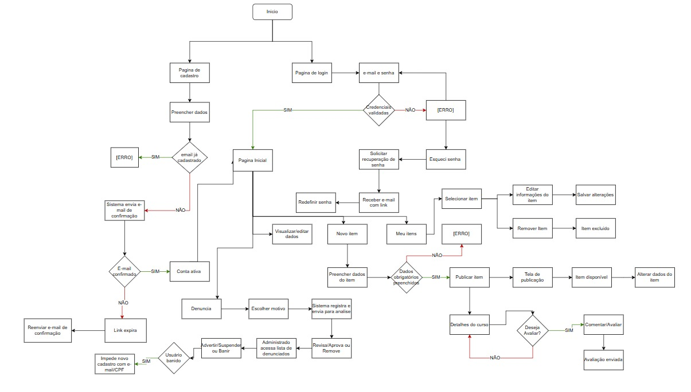
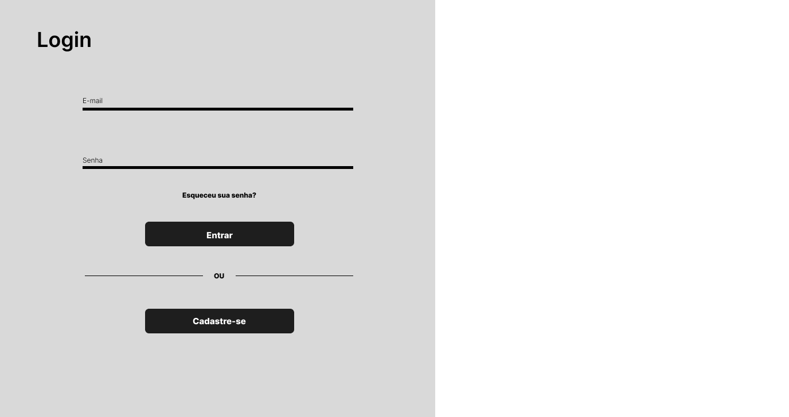
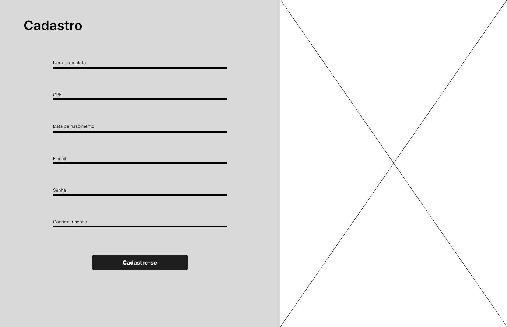
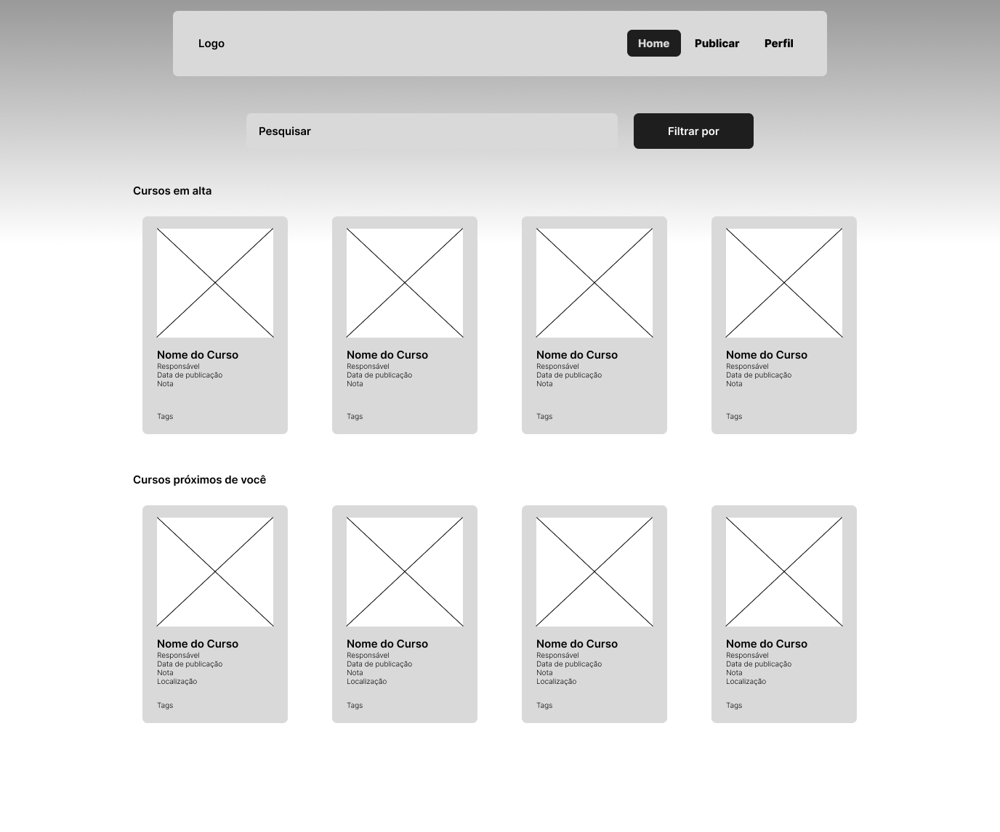
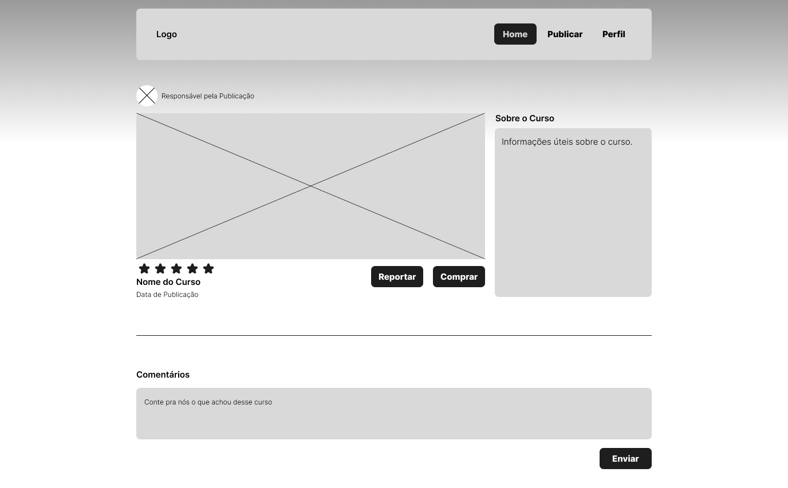
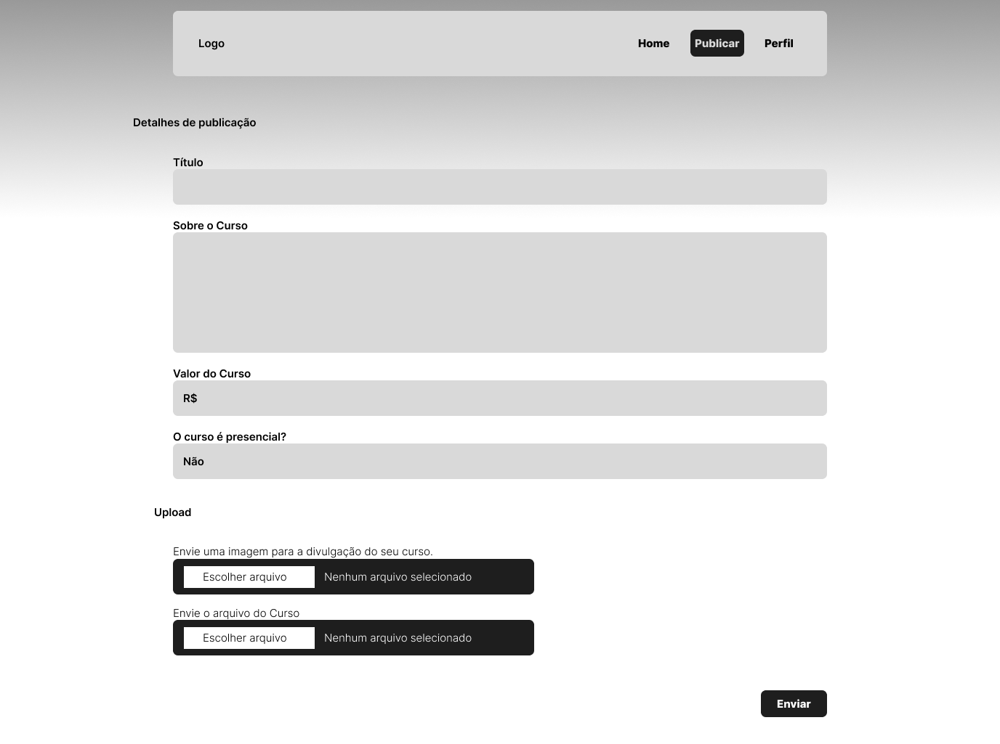
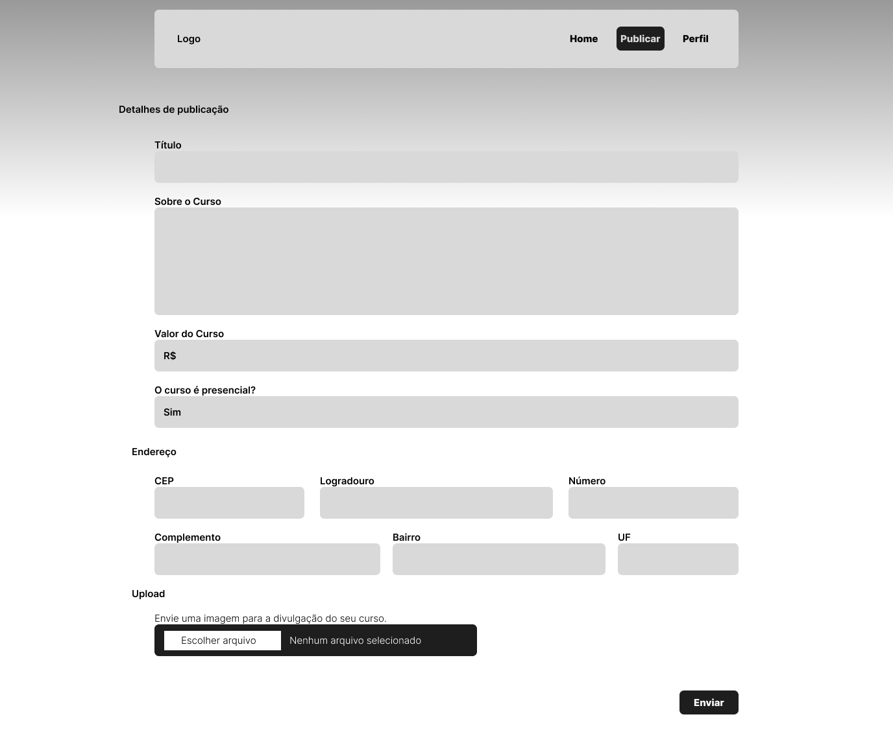
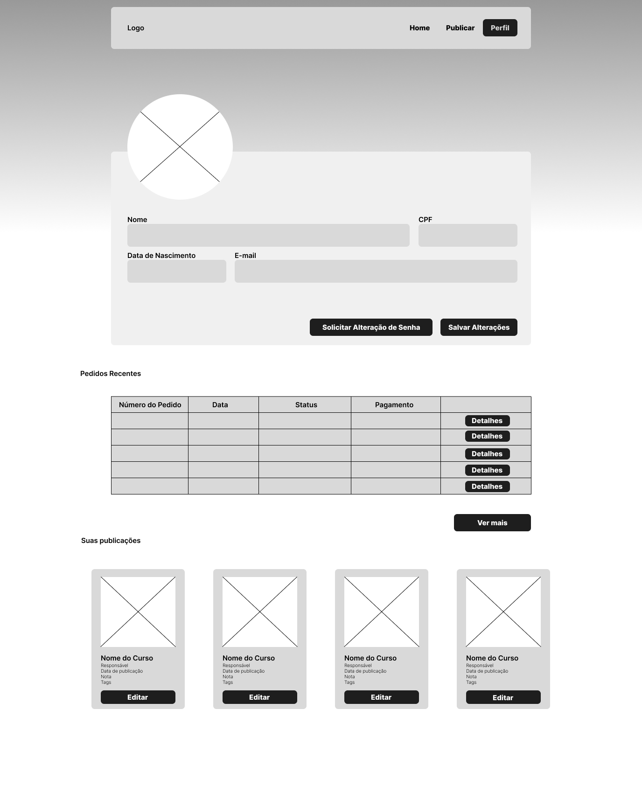
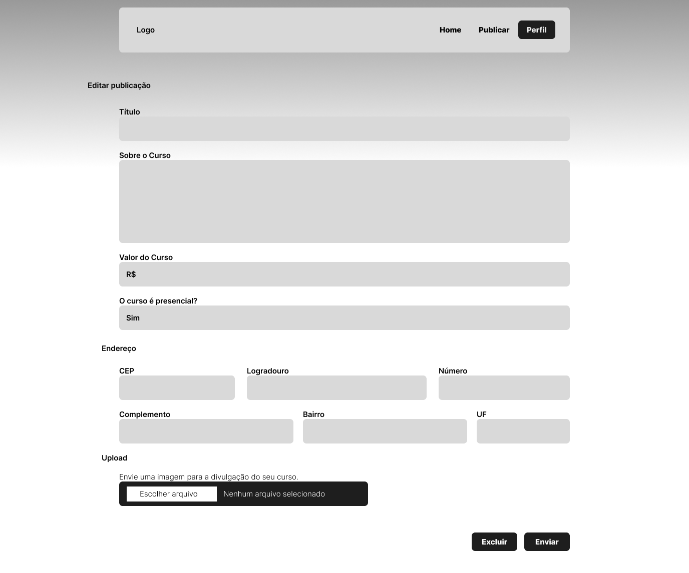
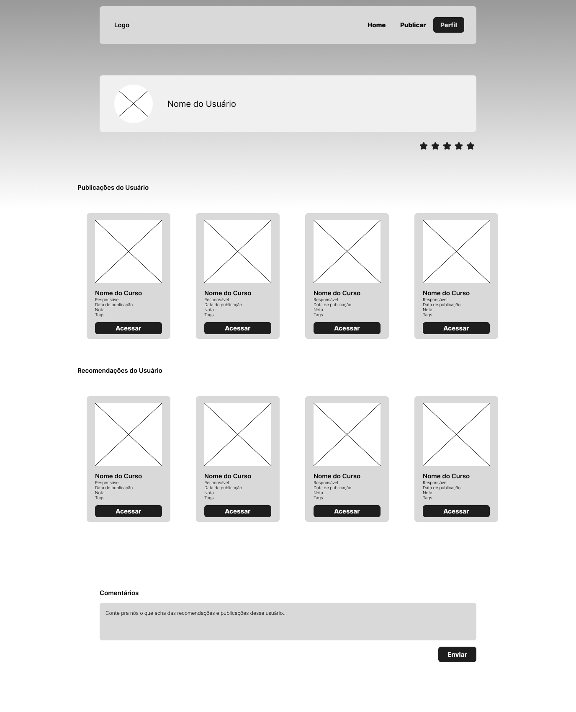

# Projeto de Interface

## Diagrama de Fluxo

O diagrama apresenta o estudo do fluxo de interação do usuário com o sistema interativo e  muitas vezes sem a necessidade do desenho do design das telas da interface. Isso permite que o design das interações seja bem planejado e gere impacto na qualidade no design do wireframe interativo que será desenvolvido logo em seguida.

## Wireframes

### Página de Login

### Página de Cadastro

RF-01, RF-02	

### Página de Esquecimento de Senha

### Página Home

RF-06, RF-07	

### Página de Detalhes da Publicação

RF-011	

### Página de Publicação (Curso Virtual)

RF-04, RF-08, RF-09	

### Página de Publicação (Curso Presencial)

RF-04, RF-08, RF-09	

### Página do Perfil do Usuário

RF-03, RF-011, RF-015	

### Página de Editar Publicação

RF-05

### Página de Visualização de Perfil de Outros Usuários

RF-010

